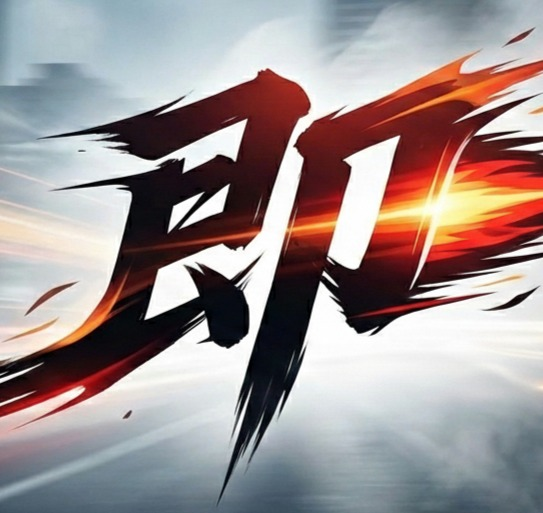

<div align="center">
  
  <h1>🏎️ Grosoq</h1>
  <p><strong>マリオカート8デラックス レース結果自動取得・分析GUIアプリケーション</strong></p>
  
  [](LICENSE)
  [](https://www.electronjs.org/)
  [](https://nextjs.org/)
  [](https://groq.com/)
</div>

---


**Grosoq**は、マリオカート8デラックス（MK8DX）のレース結果を自動的に取得・分析し、配信オーバーレイとして表示するデスクトップGUIアプリケーションです。
OBS配信とAI画像解析を組み合わせ、簡単な操作でリアルタイムスコア表示を実現します。

## 📖 Grosoqとは

**Grosoq**は、マリオカート8デラックス（MK8DX）の配信者向けに開発されたデスクトップアプリケーションです。
レース結果画面を自動的に解析し、チーム別スコアをリアルタイムで配信オーバーレイに表示します。

### 🌟 主な特徴

#### **簡単操作**
- **ワンクリック取得**: レース結果画面でボタンを押すだけで自動解析
- **設定不要**: 初回起動時に設定するだけで、その後は簡単操作
- **直感的GUI**: 分かりやすいデスクトップアプリインターフェース

#### **AI自動解析**
- **Groq AI**: 最新のAI技術でレース結果を高精度解析
- **チーム自動判別**: プレイヤー名からチーム名を自動抽出
- **自チーム検出**: 画面の色解析で自分のチームを自動認識

#### **配信連携**
- **OBS統合**: OBS WebSocketで画面を自動取得
- **オーバーレイ表示**: 配信画面に美しいスコア表示をオーバーレイ
- **リアルタイム更新**: レース結果が即座にオーバーレイに反映

#### **柔軟なスコア管理**
- **累積スコア**: 複数レースのスコアを自動累積
- **チーム別表示**: チーム名と総合得点を分かりやすく表示
- **差分表示**: 他チームとの得点差を自動計算・表示

#### **新機能（v1.2.3）**
- **改良されたアーキテクチャ**: モジュラー設計による保守性向上
- **高度なログ管理**: 詳細なログ記録と自動クリーンアップ
- **セキュリティ強化**: Context Isolation による安全性向上
- **自動更新機能**: アプリケーションの自動アップデート
- **エラー回復**: 堅牢なエラーハンドリングと自動復旧
- **設定管理**: より詳細で安全な設定システム

### 🛠️ 技術スタック
- **デスクトップアプリ**: Electron
- **バックエンド**: Express.js、JavaScript
- **AI解析**: Groq Vision API
- **配信連携**: OBS WebSocket
- **UI**: モダンなデスクトップインターフェース
- **アーキテクチャ**: 改良されたモジュラー設計

## 🚀 インストール・セットアップ

### 📋 必要な環境

#### **必須ソフトウェア**
- **OBS Studio** (v29.0以上)
  - [公式サイト](https://obsproject.com/)からダウンロード
  - WebSocketプラグインが内蔵されているバージョンを使用
- **マリオカート8デラックス** + **Nintendo Switch**
- **Groq API キー**
  - [Groq Console](https://console.groq.com/keys)で無料取得

#### **推奨環境**
- **OS**: Windows 10/11 (64bit)
- **メモリ**: 4GB以上
- **ネットワーク**: インターネット接続（AI解析のため）

### 🛠️ 簡単セットアップ

#### **方法1: 実行ファイル版（推奨）**
1. **ダウンロード**
   - [Releases](https://github.com/eito54/Grosoq/releases/latest)から最新版の`Grosoq-Setup.exe`をダウンロード
   
2. **インストール**
   - ダウンロードしたファイルを実行してインストール
   
3. **初回起動**
   - デスクトップの「Grosoq」アイコンをダブルクリック

#### **方法2: ソースコード版（開発者向け）**
```bash
# リポジトリをクローン
git clone https://github.com/eito54/Grosoq
cd Grosoq

# 依存関係をインストール
npm install

# GUIアプリを起動
npm run start
# または開発モードで起動
npm run dev
```

### ⚙️ 初期設定

#### **1. OBS WebSocket設定**
1. **OBSでWebSocketを有効化**
   - OBS → 「ツール」→ 「WebSocketサーバー設定」
   - 「WebSocketサーバーを有効にする」にチェック
   - ポート番号: `4455`（デフォルト）
   - パスワード: 設定する場合は任意の文字列

2. **Grosoqで設定**
   - アプリ起動後、設定画面で以下を入力：
     - **OBS IPアドレス**: `localhost`（同一PC）または OBSのIPアドレス
     - **ポート番号**: `4455`（デフォルト）
     - **パスワード**: OBSで設定したパスワード（未設定の場合は空欄）
     - **ソース名**: `映像キャプチャデバイス`（キャプチャボード）または `ウィンドウキャプチャ`

#### **2. Groq API設定**
1. **APIキー取得**
   - [Groq Console](https://console.groq.com/keys)にアクセス
   - Googleアカウントでログイン
   - 「Create API Key」をクリック
   - 生成されたAPIキーをコピー

2. **アプリに設定**
   - Grosoqの設定画面で「Groq API キー」にペースト
   - 「設定を保存」をクリック

#### **3. OBSソース設定**
1. **MK8DX画面をキャプチャ**
   - OBSで認識させたいソースを追加
   - Nintendo Switchの画面が映ることを確認

2. **ソース名を確認**
   - OBSのソース一覧で表示される名前をGrosoqの設定に入力(「映像キャプチャデバイス」「ウィンドウキャプチャ」等、「映像キャプチャデバイス1」などの番号が振られている場合はそれも記述)

### ✅ 動作確認

1. **接続テスト**
   - Grosoqで「接続テスト」ボタンをクリック
   - 「✅ 接続成功」が表示されれば設定完了

2. **スクリーンショット確認**
   - MK8DXの任意の画面を表示
   - 「レース結果を取得」をテストクリック
   - エラーが出なければ設定成功

## 🎮 Grosoq 使い方ガイド

### **STEP 1: アプリ起動とオーバーレイ設定**

#### **1-1. Grosoqを起動**
- デスクトップの「Grosoq」アイコンをダブルクリック
- または `start-gui.bat` ファイルを実行

#### **1-2. オーバーレイをOBSに設定**
1. **オーバーレイURLを取得**
   - Grosoqで「🖥️ オーバーレイを開く」ボタンをクリック
   - ブラウザが開き、オーバーレイ画面が表示される
   - URLをコピー

2. **OBSにブラウザソースを追加**
   - OBS → ソース → 「+」→ 「ブラウザ」
   - 名前: 「Grosoq オーバーレイ」（任意）
   - URL: コピーしたURLを貼り付け
   - 幅: `800`、高さ: `600`（お好みで調整）
   - 「OK」をクリック

3. **オーバーレイの位置調整**
   - OBSでオーバーレイの位置とサイズを調整
   - 配信画面の邪魔にならない位置に配置

### **STEP 2: ゲーム中の操作**

#### **2-1. レース結果を取得**
1. **レース終了後**
   - MK8DXのレース結果画面を表示
   - 順位と得点が完全に表示されるまで待つ

2. **結果を取得**
   - Grosoqで「📊 レース結果を取得」ボタンをクリック
   - AIが自動的に結果を解析してオーバーレイに表示

3. **結果の確認**
   - オーバーレイにチーム別スコアが表示される
   - 自チーム（黄色枠）と他チームの得点差が表示される

#### **2-2. 総合結果を取得**
1. **累積得点画面を表示**
   - MK8DXの総合結果画面（累積得点）を表示
   - 全プレイヤーの累積得点が見える状態にする

2. **総合結果を取得**
   - Grosoqで「🏆 チーム合計点を取得」ボタンをクリック
   - 全体の累積スコアがオーバーレイに反映される

### **STEP 3: スコア管理**

#### **3-1. スコアリセット**
- 新しいラウンドを始める際は「🗑️ スコアをリセット」をクリック
- 全てのスコアが0にリセットされる

#### **3-2. 設定変更**
- 「⚙️ 設定」から OBS接続設定やAPIキーを変更可能
- 設定は自動的に保存される

#### **3-3. スコア保持設定**
- 「アプリ再起動時にスコアを保持する」スイッチで、スコアの永続化を設定
- オンにすると、アプリを再起動してもスコアが保持される

### ⏰ ボタンを押すタイミング

正確なレース結果を取得するために、適切なタイミングでボタンを押してください：

#### 📸 **「レース結果を取得」の最適タイミング**

<div align="center">
  
  <p><em>✅ このような画面でボタンを押してください</em></p>
</div>

- ✅ **良いタイミング**: 順位とプレイヤー名、得点が完全に表示されている
- ❌ **悪いタイミング**: アニメーション中や画面切り替え中

#### 🏆 **「チーム合計点を取得」の最適タイミング**

<div align="center">
  
  <p><em>✅ このような累積得点画面でボタンを押してください</em></p>
</div>

- ✅ **良いタイミング**: 全プレイヤーの累積得点と順位が確定している
- ❌ **悪いタイミング**: レース途中の結果や不鮮明な画面

💡 **コツ**: 事前に撮影したスクリーンショットを表示しても解析可能です！

## 🔧 トラブルシューティング

### **よくある問題と解決方法**

#### **🔴 「OBS接続エラー」が出る場合**
1. **OBS WebSocketが有効か確認**
   - OBS → 「ツール」→ 「WebSocketサーバー設定」
   - 「WebSocketサーバーを有効にする」にチェックが入っているか確認

2. **設定値を確認**
   - IPアドレス: `localhost`（同一PC）
   - ポート番号: `4455`（デフォルト）
   - パスワード: OBSで設定した値と一致しているか

3. **OBSの再起動**
   - OBSを完全に終了して再起動
   - Grosoqでもう一度接続テスト

#### **🔴 「スクリーンショット取得失敗」が出る場合**
1. **ソース名を確認**
   - OBSのソース一覧で表示される名前を正確にコピー
   - 例: `映像キャプチャデバイス`、`ウィンドウキャプチャ`

2. **ソースが表示されているか確認**
   - OBSでそのソースが正常に映像を表示しているか確認
   - ソースが非表示になっていないか確認

#### **🔴 「AI解析エラー」が出る場合**
1. **Groq APIキーを確認**
   - [Groq Console](https://console.groq.com/keys)で正しいキーか確認
   - キーを再生成して設定し直す

2. **画面の状態を確認**
   - レース結果画面が鮮明に表示されているか
   - 他のウィンドウが重なっていないか
   - アニメーション中ではなく、静止した画面で実行

#### **🔴 「チーム判別がおかしい」場合**
1. **プレイヤー名を確認**
   - チーム名の共通部分が名前に含まれているか
   - 例: `TeamA_Player1`, `TeamA_Player2` など

2. **手動調整**
   - オーバーレイ画面でチーム名をダブルクリックして手動編集可能

#### **🔴 「オーバーレイが表示されない」場合**
1. **URLを確認**
   - OBSのブラウザソースのURLが正しいか確認
   - `http://localhost:3000/static?overlay=true`

2. **ポート確認**
   - 他のアプリが3000番ポートを使用していないか確認
   - Grosoqのステータス表示を確認

#### **🔴 「ログファイルが見つからない」場合**
1. **ログファイルの場所を確認**
   - Windows: `%APPDATA%/grosoq/logs/`
   - macOS: `~/Library/Application Support/grosoq/logs/`
   - Linux: `~/.config/grosoq/logs/`

2. **権限を確認**
   - アプリケーションがログファイルを作成する権限があるか確認
   - 必要に応じて管理者権限で実行

#### **🔴 「設定が保存されない」場合**
1. **設定ファイルの場所を確認**
   - 設定ファイルは自動的に適切な場所に保存されます
   - アプリケーション再起動後も設定が保持されるか確認

2. **設定の初期化**
   - 設定に問題がある場合は、アプリを再インストールして初期設定からやり直し

#### **🔴 「アプリケーションが起動しない」場合**
1. **ログファイルを確認**
   - エラーの詳細がログファイルに記録されている可能性があります

2. **依存関係を確認**
   - 必要な Node.js のバージョンがインストールされているか確認
   - ソースコード版の場合は `npm install` を再実行

### **⚠️ 注意事項**
- **インターネット接続必須**: AI解析にはインターネット接続が必要
- **Groq API制限**: 無料版には月間の利用制限があります
- **画面解像度**: 高解像度で鮮明な画面ほど解析精度が向上します
- **ログ管理**: ログファイルは7日間保持され、自動的にクリーンアップされます
- **設定ファイル**: 設定は自動的にバックアップされ、破損時は自動復旧されます

## 💡 よくある質問 (FAQ)

**Q: 料金はかかりますか？**
A: Grosoq自体は無料です。Groq APIも無料枠内で使用できます。

**Q: 他の配信ソフトでも使えますか？**
A: 現在はOBS Studioのみ対応しています。

**Q: チーム名を手動で設定できますか？**
A: はい。オーバーレイ画面でチーム名部分をダブルクリックすると編集できます。

**Q: 複数のレースの合計点を管理できますか？**
A: はい。レース毎にスコアが累積され、総合得点が表示されます。

**Q: 設定をバックアップできますか？**
A: 設定は自動的に適切な場所に保存され、破損時は自動復旧されます。手動バックアップも可能です。

**Q: ログファイルはどこに保存されますか？**
A: ユーザーデータフォルダ内の logs ディレクトリに日付別で自動保存され、7日後に自動削除されます。

**Q: ダークモードに対応していますか？**
A: はい。アプリケーション内でライト・ダークモードを切り替えることができます。

**Q: 他の言語に対応していますか？**
A: 現在は日本語と英語に対応しており、アプリ内で動的に切り替え可能です。

**Q: 自動更新機能はありますか？**
A: はい。新しいバージョンが利用可能になると自動的に通知され、ワンクリックで更新できます。

## 📞 サポート・お問い合わせ

- **バグ報告**: [GitHub Issues](https://github.com/eito54/Grosoq/issues)で報告してください
- **機能要望**: [GitHub Discussions](https://github.com/eito54/Grosoq/discussions)でご提案ください
- **使い方相談**: GitHubのDiscussionsで質問できます

## 📚 開発者向けドキュメント

詳細な技術仕様や開発に関する情報は以下のドキュメントをご覧ください：

- **[ARCHITECTURE.md](./ARCHITECTURE.md)** - アーキテクチャの詳細設計
- **[MIGRATION-GUIDE.md](./MIGRATION-GUIDE.md)** - 旧バージョンからの移行ガイド
- **[REFACTORING-SUMMARY.md](./REFACTORING-SUMMARY.md)** - リファクタリングの完全サマリー

### 技術的特徴
- **モジュラー設計**: 保守性と拡張性を重視した設計
- **セキュリティ重視**: Context Isolationによる安全な実装
- **ログ管理**: 詳細なログ記録と自動管理
- **国際化対応**: 多言語サポートの完全実装
- **エラー処理**: 堅牢なエラーハンドリングシステム

## 📄 ライセンス

MIT License - 詳細は[LICENSE](LICENSE)ファイルをご覧ください。

## 🙏 謝辞-Special thanks

このプロジェクトは[mk8dx-bot](https://github.com/keisuke071411/mk8dx-bot)からインスピレーションを得て開発されました。
 [@keisuke071411](https://github.com/keisuke071411) さん、ありがとうございます！

残りレース数の表示ロジックを考案していただいたnimura_feat.mmさん (https://x.com/Nishimura_mm
)、ありがとうございます！


## 📝 更新履歴

- **v1.2.3**: アーキテクチャ大幅改善
  - モジュラー設計への完全リファクタリング
  - セキュリティ強化（Context Isolation実装）
  - 高度なログ管理システム
  - 自動更新機能
  - 改良された設定管理システム
  - エラーハンドリングと自動復旧機能

- **v1.2.2**: 安定性向上
  - バグ修正と最適化
  - UI/UX改善

- **v1.0.0**: 初回リリース
  - デスクトップGUIアプリケーション
  - OBS WebSocket連携
  - Groq AI解析
  - リアルタイムオーバーレイ表示
